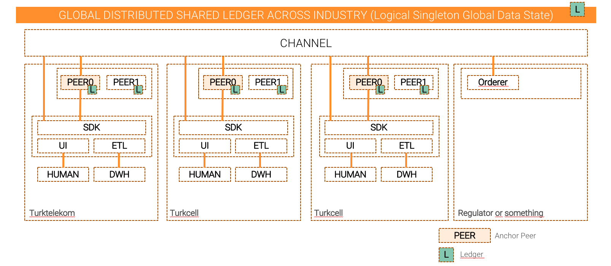
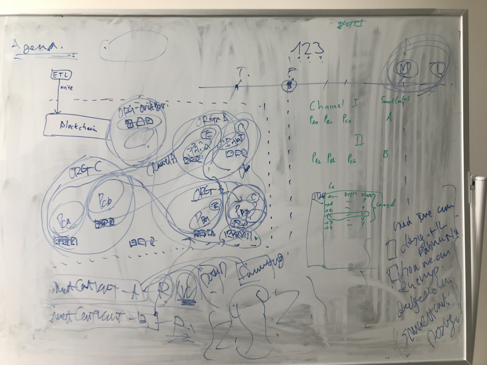

# Fabric Hyperledger Telco Use Case Prototype

This repository is to accomplish a common use case in Telco industry, which aims to share their blacklist customer over across the three biggest organizations with a decent privacies to read and write.

### Purposes/Motivations

1. Build a quick runable prototype with some basic business requirements and functionalities to support building a robust product road-map in the beginning
2. Build a bootstrap script to bootstrap common overraped system structure
3. Build a benchmark tool to measure and simulate technical scalabilities

### Network Structure

* Channel
* Endorsement Policy

### Systems Infrastructure in high level



<!-- ### Diagram A


### Diagram B

 -->

### Basic Requirements (MVP1)
* Store `blacklisted customer information` as a digital asset on a global distributed shared ledger
  * Maintain the shared customer information (digital assets) cooperately among across three organizations (Competitor/Non-trusted)
* Each organiaztion can inquery to a ledger to fetch customer information by an unique customer identify

### Internal Benchmark Tool (MVP2)

* Build a benchmark system by building some infrastructure stress scenario to eliminate scalable uncertainties

### Advanced Requirements (MVP3)

* An inquery from company A should be anonymous (Company B and C Should not know when and who make an inquery from company A)
* Each organiaztion can inquery to a ledger to see if it is a specific customer blacklisted by an unique customer identify.
* Data input will be totally from each parties Desition Making Data Ware House

### Network Visualization and logging tool (MVP4)

* Explore Blockchain
* System reliability dashboard

# How to Run-up basic fabric network

Use a single bootstrap script which automates fundamental procedures to define and build a basic fabric network

# How to access ancher peer in Organization A via CLI command

### Procedures
```
```

### Things to check

- [ ] Ability to invoke `InitLedger` and see how does it response in cases of:
  - [ ] running only one peer of myself
  - [ ] running only two peers of myself and another
  - [ ] running all peers
- [ ] Ability to invoke `queryAllCustomers`
  - [ ] running only one peer of myself
  - [ ] running only two peers of myself and another
  - [ ] running all peers
- [ ] Ability to invoke `addCustomer`
  - [ ] running only one peer of myself
  - [ ] running only two peers of myself and another
  - [ ] running all peers
- [ ] Ability to invoke `modifyCustomer`
  - [ ] running only one peer of myself
  - [ ] running only two peers of myself and another
  - [ ] running all peers

# How to access ancher peer in Organization B via CLI command
### Procedures
```
```

### Things to check

- [ ] Ability to invoke `InitLedger`
  - [ ] running only one peer of myself
  - [ ] running only two peers of myself and another
  - [ ] running all peers
- [ ] Ability to invoke `queryAllCustomer`
  - [ ] running only one peer of myself
  - [ ] running only two peers of myself and another
  - [ ] running all peers
- [ ] Ability to invoke `addCustomer`
  - [ ] running only one peer of myself
  - [ ] running only two peers of myself and another
  - [ ] running all peers
- [ ] Ability to invoke `modifyCustomer`
  - [ ] running only one peer of myself
  - [ ] running only two peers of myself and another
  - [ ] running all peers

# How to access ancher peer in Organization C via CLI command
### Procedures
```
```

### Things to check

- [ ] Ability to invoke `InitLedger`
  - [ ] running only one peer of myself
  - [ ] running only two peers of myself and another
  - [ ] running all peers
- [ ] Ability to invoke `queryAllCustomer`
  - [ ] running only one peer of myself
  - [ ] running only two peers of myself and another
  - [ ] running all peers
- [ ] Ability to invoke `addCustomer`
  - [ ] running only one peer of myself
  - [ ] running only two peers of myself and another
  - [ ] running all peers
- [ ] Ability to invoke `modifyCustomer`
  - [ ] running only one peer of myself
  - [ ] running only two peers of myself and another
  - [ ] running all peers


# Systems Architecture (Details)

[Details in separate page](./docs/syste-architecture-in-details/)


# Busienss Estimations

[Product Road Map in separate page](./docs/product-road-map/)

# Todos Note

- [ ] Network Bootstrap script
  - [ ] Create two peers for writing responsibility within a give organization
  - [ ] Create two peers for reading responsibility within a give organization
  - [ ] Instantiate a chaincode with populating initial five blacklist records (On two channels, which means 
  - [ ] Design General DLT Network Design based on business requirements
  - [ ] Build-up Distributed Ledger Business network based on general design
  - [ ] Launch network; create channels; join peers to channles
  - [ ] Install and Instantiate smart contract
- [ ] Core Smart contract
  - [ ] Define Assets Data Definitions
  - [ ] Implement Data Assets on Smart Contract
  - [ ] Design General functionalities and business logics on smart contracts
  - [ ] Implement business logics on smart contract
- [ ] Setup Explore Hyperledger
  - [ ] 
- [ ] Setup Client SDK application
  - [ ] Implement an user-faced application with node SDK
  - [ ] Implement an application with CLI SDK