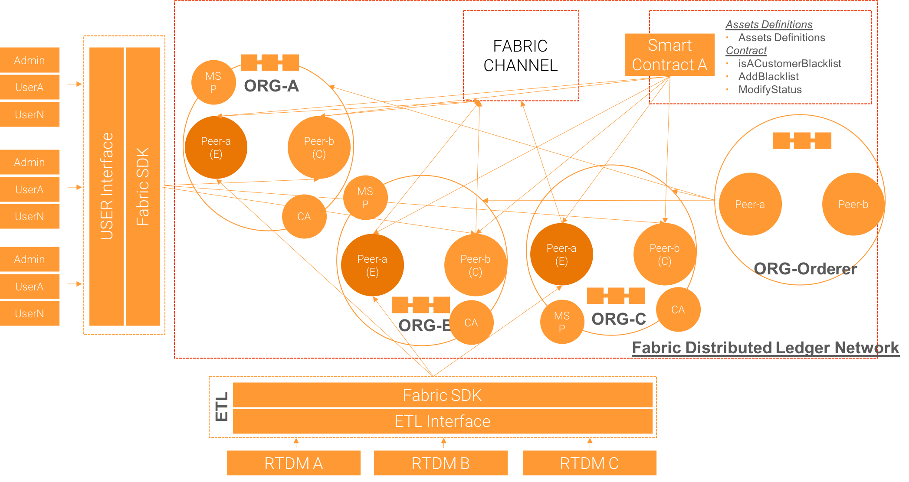

# Fabric Hyperledger Telco Use Case Prototype

This repository is to accomplish a common use case in Telco industry, which aims to share their blacklist customer over across the three biggest organizations with a decent privacies to read and write.

### Basic Requirements
* Shared ledger stores a blacklisted customer information
* An inquery from company A should be anonymous (Company B and C Should not know when and who make an inquery from company A)
* Data input will be totally from each parties Desition Making Data Ware House

### Systems Infrastructure in high level (v1)



### Diagram A


### Diagram B


# Separation of Ledgers solution

There is one unique business requirement

> An inquery from company A should be anonymous (Company B and C Should not know when and who make an inquery from company A)

### High level Diagram


# Network Bootstraping Process

This scripts will automate and bootstrap common infrastructure for typical enterprise Distributed Ledger Network, which consists of:

1. Generate Genesis Blocks
2. Build and up each docker containers
3. Create and configure channels
4. Create and configure smartcontract
5. Initialize ledger
6. Test some sample queries

## 1. Generate Genesis Blocks

### 1.1. Create Genesis Block along with channel artifact for each organizations

```
cryptogen generate --config=./crypto-config.yaml
```

### 1.2. Generate channel artifacts for each participant organizations

```
configtxgen -profile TurkTelecomOrdererGenesis -outputBlock ./channel-artifacts/genesis.block

configtxgen -profile TurkTelecomeChannel -outputCreateChannelTx ./channel-artifacts/channel.tx -channelID $CHANNEL_NAME
configtxgen -profile TurkTelecomeChannel -outputAnchorPeersUpdate ./channel-artifacts/TurkTelekomMSPanchors.tx -channelID $CHANNEL_NAME -asOrg TurkTelekomMSP
configtxgen -profile TurkTelecomeChannel -outputAnchorPeersUpdate ./channel-artifacts/TurkcellMSPanchors.tx -channelID $CHANNEL_NAME -asOrg TurkcellMSP
configtxgen -profile TurkTelecomeChannel -outputAnchorPeersUpdate ./channel-artifacts/VodafoneMSPanchors.tx -channelID $CHANNEL_NAME -asOrg VodafoneMSP
```

## 2. Build Docker Containers (each peers, singleton orderer)

### 2.1. Build and up docker compose
```
IMAGE_TAG=latest docker-compose -f docker-compose.yaml up -d 2>&1
```

## 3. Channel Configurations

### 3.1. Configure each Channels
```
peer channel join -b $CHANNEL_NAME.block
```

### 3.2. Let peers join in specific channels
```
peer channel join -b $CHANNEL_NAME.block
```

### 3.3. update Anchor for each Peers
```
peer channel update -o orderer.ki-decentralized.de:7050 -c $CHANNEL_NAME -f ./channel-artifacts/${CORE_PEER_LOCALMSPID}anchors.tx >&log.txt
```

## 3. Chaincode Configurations

### 3.1. Install Chaincode on peer0 for each organizations
```
peer chaincode install -n mycc -v ${VERSION} -l ${LANGUAGE} -p ${CC_SRC_PATH}
```

### 3.2. Instantiate Chaincode
```
peer chaincode instantiate -o orderer.ki-decentralized.de:7050 -C $CHANNEL_NAME -n mycc -l ${LANGUAGE} -v ${VERSION} -c '{"Args":["init"]}'
```

### 3.3. Invoke InitLedger function on a chaincode
```
peer chaincode invoke -o orderer.ki-decentralized.de:7050  --tls $CORE_PEER_TLS_ENABLED --cafile $ORDERER_CA -C $CHANNEL_NAME -n mycc -c '{"Args":["initLedger"]}'
```

### 3.4. Invoke quaryAll function on a chaincode for a test
```
peer chaincode invoke -o orderer.ki-decentralized.de:7050 --tls true --cafile /opt/gopath/src/github.com/hyperledger/fabric/peer/crypto/ordererOrganizations/ki-decentralized.de/orderers/orderer.ki-decentralized.de/msp/tlscacerts/tlsca.ki-decentralized.de-cert.pem -C turktelcomchannel -n mycc -c '{"Args":["queryAllCustomers"]}'
```

# Explore Hyperledger setup process

## References

- [Official README on git repository](https://github.com/hyperledger/blockchain-explorer)

## 1. Setup Database container

## 2. Configure to Fabric Network

### 2.1. Configure Fabric network config file accordingly

```
{
"network-config": {
	"org1": {
		"name": "peerOrg1",
		"mspid": "Org1MSP",
		"peer1": {
			"requests": "grpcs://127.0.0.1:7051",
			"events": "grpcs://127.0.0.1:7053",
			"server-hostname": "peer0.org1.example.com",
			"tls_cacerts": "fabric-path/fabric-samples/first-network/crypto-config/peerOrganizations/org1.example.com/peers/peer0.org1.example.com/tls/ca.crt"
		},
		"peer2": {
			"requests": "grpcs://127.0.0.1:8051",
			"events": "grpcs://127.0.0.1:8053",
			"server-hostname": "peer1.org1.example.com",
			"tls_cacerts": "fabric-path/fabric-samples/first-network/crypto-config/peerOrganizations/org1.example.com/peers/peer1.org1.example.com/tls/ca.crt"
		},
		"admin": {
			"key": "fabric-path/fabric-samples/first-network/crypto-config/peerOrganizations/org1.example.com/users/Admin@org1.example.com/msp/keystore",
			"cert": "fabric-path/fabric-samples/first-network/crypto-config/peerOrganizations/org1.example.com/users/Admin@org1.example.com/msp/signcerts"
		}
	},
	"org2": {
		"name": "peerOrg2",
		"mspid": "Org2MSP",
		"peer1": {
			"requests": "grpcs://127.0.0.1:9051",
			"events": "grpcs://127.0.0.1:9053",
			"server-hostname": "peer0.org2.example.com",
			"tls_cacerts": "fabric-path/fabric-samples/first-network/crypto-config/peerOrganizations/org2.example.com/peers/peer0.org2.example.com/tls/ca.crt"
		},
		"peer2": {
			"requests": "grpcs://127.0.0.1:10051",
			"events": "grpcs://127.0.0.1:10053",
			"server-hostname": "peer1.org2.example.com",
			"tls_cacerts": "fabric-path/fabric-samples/first-network/crypto-config/peerOrganizations/org2.example.com/peers/peer1.org2.example.com/tls/ca.crt"
		},
		"admin": {
			"key": "fabric-path/fabric-samples/first-network/crypto-config/peerOrganizations/org2.example.com/users/Admin@org2.example.com/msp/keystore",
			"cert": "fabric-path/fabric-samples/first-network/crypto-config/peerOrganizations/org2.example.com/users/Admin@org2.example.com/msp/signcerts"
		}
	}
},
"channel": "mychannel",
"orderers":[
			{
			"mspid": "OrdererMSP",
			"server-hostname":"orderer.example.com",
			"requests":"grpcs://127.0.0.1:7050",
			"tls_cacerts":"fabric-path/fabric-samples/first-network/crypto-config/ordererOrganizations/example.com/orderers/orderer.example.com/tls/ca.crt"
			}
			],
"keyValueStore": "/tmp/fabric-client-kvs",
"configtxgenToolPath": "fabric-path/fabric-samples/bin",
"SYNC_START_DATE_FORMAT":"YYYY/MM/DD",
"syncStartDate":"2018/01/01",
"eventWaitTime": "30000",
"license": "Apache-2.0",
"version": "1.1"
}
```

## 3. Run Explore App


# General Business Process and Operations

* Ability to inquery a customer to see if whether a specific number is on a blacklist or not, along with amout of debt and due date etc.
* How is a data input look like? Only from ETL integration from another system?
  * Who is going to input new data, and from where to where?
  * What's a consensus agreement to add a number to black list?
  * How could it move the data into blockchain?
* How is a data change look like? Only from ETL integration from another system?
  * Who is going to modify data, and from where to where?
  * What's a consensus agreement to change a number off from black list?
  * How could it move the data into blockchain?
* How to identify the customer?
  * Is there any general agreement among the three parties at this point?
  * What's a mapping mechanism to match the same customer?
  * Is there any legal obstacles we may need to get over?
* How is the organization structure look like?
  * is there only three organizations at first?
  * How many roughly phone network operators within an organization?
  * is it necessary to give a specific permission to a specific role?
    * e.g.) only a specific person could input&modify data on ledger
* General Business Values?
  * Why they want to share a blacklist? if it's high demand, why there is no existed general system?


# Busienss Estimations
* Data Integration Design and Implementation
  * General
    * Analyze Data Definitions for each Data Input source (RTDM)
  * Initial Data Population

# Todos Note

- [ ] Network Bootstrap script
  - [ ] Create two peers for writing responsibility within a give organization
  - [ ] Create two peers for reading responsibility within a give organization
  - [ ] Instantiate a chaincode with populating initial five blacklist records (On two channels, which means 
  - [ ] Design General DLT Network Design based on business requirements
  - [ ] Build-up Distributed Ledger Business network based on general design
  - [ ] Launch network; create channels; join peers to channles
  - [ ] Install and Instantiate smart contract
- [ ] Core Smart contract
  - [ ] Define Assets Data Definitions
  - [ ] Implement Data Assets on Smart Contract
  - [ ] Design General functionalities and business logics on smart contracts
  - [ ] Implement business logics on smart contract
- [ ] Setup Explore Hyperledger
  - [ ] 
- [ ] Setup Client SDK application
  - [ ] Implement an user-faced application with node SDK
  - [ ] Implement an application with CLI SDK