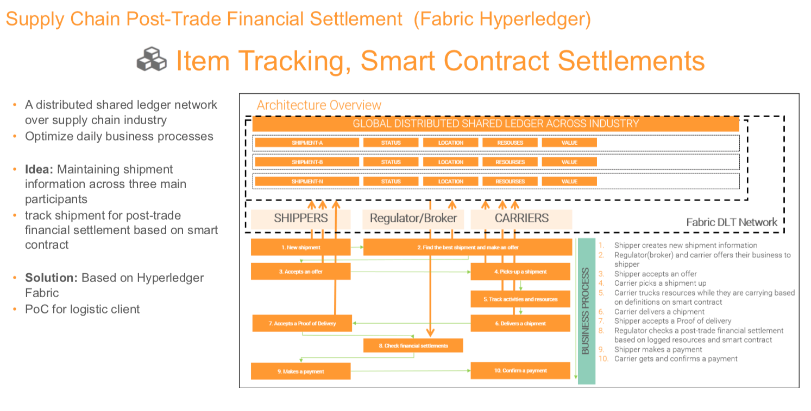
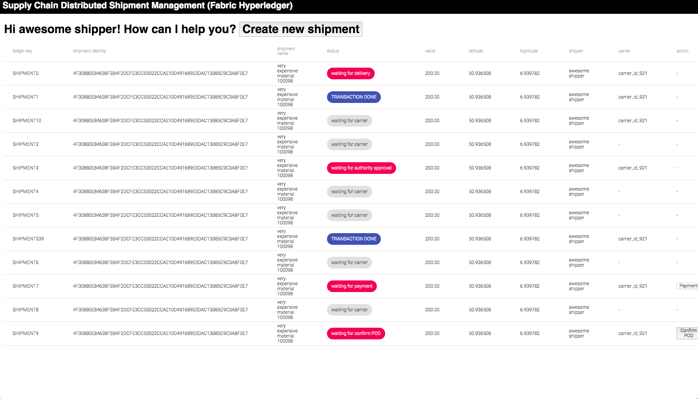
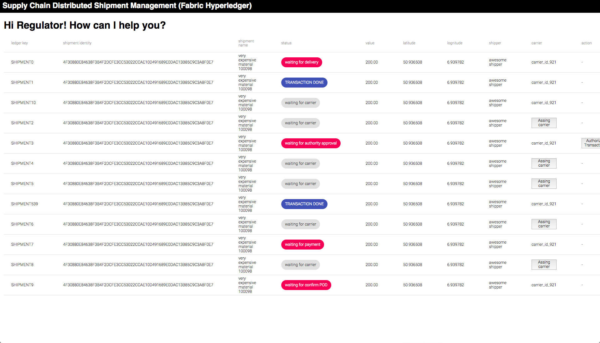
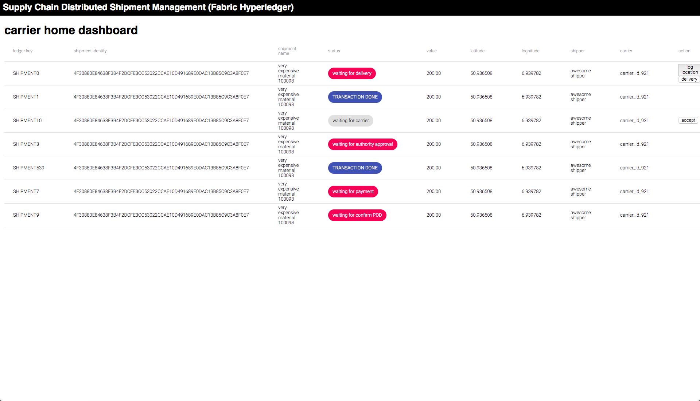

# Fabric Hyperledger Prototype

A bootstrap project for a common use case in Telco industry, which aims to share their blacklist customer over across multiple organizations with aiming some private-data requirements. This activity is a part of [IDPP#22](https://github.kigroup.de/ki-decentralized/IDPPs/issues/22)

## Project Overview

### Purposes/Motivations

1. Build a quick runable prototype with some basic business requirements and functionalities to support building a robust product road-map in the beginning
2. Build a bootstrap script to bootstrap common overraped system structure
3. Build a benchmark tool to measure and simulate technical scalabilities

### Systems Infrastructure in high level


<!-- ### Diagram A


### Diagram B

 -->

### Basic Requirements (MVP1)
* Store `blacklisted customer information` as a digital asset on a global distributed shared ledger
  * Maintain the shared customer information (digital assets) cooperately among across three organizations (Competitor/Non-trusted)
* Each organiaztion can inquery to a ledger to fetch customer information by an unique customer identify
* Proof of Concepts on how to define endorsement policies by designing query test-guideline and fulfilling them

### Supply Chain User Interface showcase (MVP2)

#### Architecture Overview


#### Shipper Dashboard



#### Authority Dashboard


#### Carrier Dashboard


### Internal Benchmark Tool (MVP3)

* Build a benchmark system by building some infrastructure stress scenario to eliminate scalable uncertainties

***A simple inserting benchmark***

```
1. Determine x(10 to 60, no duplications) numbers(seconds to make a query) to input within a minute
2. Insert a blacklist record at a specific second which was defined in phase 1
3. Repeat phase 1 and 2 for y(5 to 30) times(minutes) 
4. See a transaction log to reconcile the transactions to have an inserting benchmark
```

***Figure out how to see transaction logs and world state in given place:***

- [ ] Global Shared Ledger
- [ ] Channel
- [ ] Peer 0 Organization A
- [ ] Peer 1 Organization A
- [ ] Peer 0 Organization B
- [ ] Peer 1 Organization B
- [ ] Peer 0 Organization C
- [ ] Peer 1 Organization C

### Network Visualization and logging tool (MVP4)

* Explore Blockchain
* System reliability dashboard

### Advanced Requirements (MVP5)

* An inquery from company A should be anonymous (Company B and C Should not know when and who make an inquery from company A)
* Each organiaztion can inquery to a ledger to see if it is a specific customer blacklisted by an unique customer identify.
* Data input will be totally from each parties Desition Making Data Ware House


## How to Run-up basic fabric network

Use a single bootstrap script which automates fundamental procedures to define and build a basic fabric network, in which procedures consist of:

1. Generate each `crypto-config` based on a [config file](./crypto-config.yaml)
2. Generate channel artifacts and genesis block
3. Build and up each docker containers based on a [config file](./docker-compose.yaml)
4. Basic channel configurations (Create/Join/AncherPeers)
5. Basic chaincode configurations (Install/Instantiate)

```
$ git clone https://github.kigroup.de/t-ishikawa/dlt-fabric-use-case-telco/tree/develop
$ cd dlt-fabric-use-case-telco
$ ./generate-and-up-distributed-network.sh
```
## Todos

#### UI
- [x] Setup React/Redux UI components dev environment
- [x] Display root dashboard screen
- [x] Create new shipment via shipper dashboard
- [ ] Display shipment list on shipper dashboard
- [ ] Accept POD via shipper dashboard
- [ ] Make a payment via shipper dashboard
- [x] Display shipment list via regulator dashboard
- [x] Assign a shipment to a carrier via regulator dashboard
- [x] Display shipment list via carrier dashboard
- [ ] Accept assingned shipment via carrier dashboard
- [ ] Pickup shipment via carrier dashboard
- [ ] Log location via carrier dashboard
- [ ] deliver shipment via carrier dashboard

#### Middleware
- [x] Setup Node Express middleware api server
- [x] API to Make a new shipment on shipper dashboard
- [ ] API to give a list of shipment on shipper dashboard
- [x] API to give a list of shipment on regulatory dashboard
- [x] API to assign a carrier on a shipment via regulatory dashboard
- [x] API to give a list of shipment on carrier dashboard
- [ ] API to accept an assignment on carrier dashboard
- [ ] API to confirm a pickup on carrier dashboard
- [ ] API to log a location on carrier dashboard
- [ ] API to confirm delivery on carrier dashboard
- [ ] API to confirm POD on shipper dashboard
- [ ] API to confirm transaction on regulatory dashboard
- [ ] API to make a payment on shipper dashboard

#### SmartContract (development)
- [x] Create a new shipment
- [ ] Fetch a list of shipment on shipper based on shipper id
- [x] Fetch a list of shipment on regulator
- [x] Assign a carrier on a shipment
- [ ] Accept an assignment on a shipment by carrier
- [ ] Confirm a pickup
- [ ] Make a location log
- [ ] Confirm a delivery
- [x] Fetch a list of shipment on carrier based on carrier id

#### SmartContract (operation)
- [x] Install
- [x] Instantiate
- [x] upgrade
- [ ] establish an easier way to validate smart contract before install

#### DLT Network
- [x] Write a script to Bootstrap basic network
- [ ] Stress test benchmark scripts
- [ ] Network Visualizations