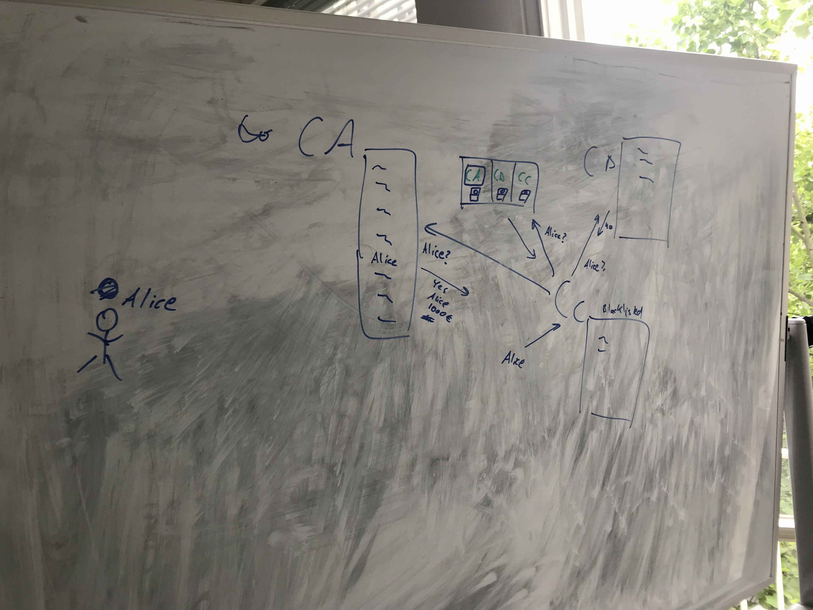

# Global Tobacco Supply Chain Prototype

A prototype repository for the global tobacco supply chain industrial start-up to pitch my idea for angel investors.

## The Minimum Detailed Scenario

1. Seed Producer in Norway generates x grams of seeds
2. Authority moves(purchase) y amount of seeds from seed producer
3. Road carrier carries the seed from seed producer to port in Norway
4. Export authority in Norway authorizes the seeds to export
5. Oversea carrier carries the seed from a port in Norway to a port in Brazil
6. Import authority in Brazil authorizes the seeds to import
7. Road carrier carries the seed from a port to firmer
8. Firmer confirms the seed to get

## The minimum functionalities

* Identify seed providor
* Identify production company
* Identify export authority
* Identify import authority
* Identify road carrier
* Identify oversea carrier
* Identify firmer

## A Usecase Scenario

* Authority wants to check which firmer bought which seeds from which seed provider
* There is a high-quality seed provider in Norway to produce seeds from something (START)
* Regulator wants to purchase seeds in Norway and give them to firmers in Brazil (Oversea Transportation)
* There is a firmer who is based in Brazil to grow leafs from seeds
* Regulator wants to purchase the leafs in Brazil and give them to factory in Indonesia (Oversea Transportation)
* There is a factory in Indonesia to produce packages from leafs
* Regulator wants to purchase the packages in Indonesia and give them to Retailer in Russia (Oversea Transportation)
* There is a retailer in Russia to sell products
* There is a consumer in Russian to buy products to consume (END)

## Industrial Players

* Regulators
  * WHO
  * Govornments
* Production Companies
  * JT International (JTI) - Japan, HQ-Switzerland
  * JT Group - Japan, HQ-Japan
  * Philip Morris International (PMI) - US, HQ-Switzerland
  * Altria - US
  * British American Tobacco (BAT) - UK
  * Reynolds American - US
  * Imperial Brands - UK
* Labors
  * Import Authority
  * Export Authority
  * Seed Producer
  * Firmer
  * Product Factory
  * Retailers
* Carriers
  * Road Carrier
  * Oversea Carrier
* Consumers


## List of Potential Angel Investors

...

## Project Overview

### Purposes/Motivations

1. Build a quick runable prototype with some basic business requirements and functionalities to support building a robust product road-map in the beginning
2. Build a bootstrap script to bootstrap common overraped system structure
3. Build a benchmark tool to measure and simulate technical scalabilities

### Systems Infrastructure in high level


<!-- ### Diagram A



### Diagram B

 -->

### Basic Requirements (MVP1)
* Store `blacklisted customer information` as a digital asset on a global distributed shared ledger
  * Maintain the shared customer information (digital assets) cooperately among across three organizations (Competitor/Non-trusted)
* Each organiaztion can inquery to a ledger to fetch customer information by an unique customer identify
* Proof of Concepts on how to define endorsement policies by designing query test-guideline and fulfilling them

### Supply Chain User Interface showcase (MVP2)

#### Architecture Overview


#### Shipper Dashboard


#### Authority Dashboard


#### Carrier Dashboard


### Internal Benchmark Tool (MVP3)

* Build a benchmark system by building some infrastructure stress scenario to eliminate scalable uncertainties

***A simple inserting benchmark***

```
1. Determine x(10 to 60, no duplications) numbers(seconds to make a query) to input within a minute
2. Insert a blacklist record at a specific second which was defined in phase 1
3. Repeat phase 1 and 2 for y(5 to 30) times(minutes) 
4. See a transaction log to reconcile the transactions to have an inserting benchmark
```

***Figure out how to see transaction logs and world state in given place:***

- [ ] Global Shared Ledger
- [ ] Channel
- [ ] Peer 0 Organization A
- [ ] Peer 1 Organization A
- [ ] Peer 0 Organization B
- [ ] Peer 1 Organization B
- [ ] Peer 0 Organization C
- [ ] Peer 1 Organization C

### Network Visualization and logging tool (MVP4)

* Explore Blockchain
* System reliability dashboard

### Advanced Requirements (MVP5)

* An inquery from company A should be anonymous (Company B and C Should not know when and who make an inquery from company A)
* Each organiaztion can inquery to a ledger to see if it is a specific customer blacklisted by an unique customer identify.
* Data input will be totally from each parties Desition Making Data Ware House


## How to Run

Use a single bootstrap script which automates fundamental procedures to define and build a basic fabric network, in which procedures consist of:
### Pre Requirement
```
$ git clone https://github.kigroup.de/t-ishikawa/fabric-hl-usecase-supply-chain.git
```

### DLT Network
```
$ ./generate-and-up-distributed-network.sh
```

### Middleware
```
$ cd middleware
$ npm install
$ node enrollAdmin.js
$ node registerUser.js
$ node index.js
$ open localhost:9998
```

### UI
```
$ cd ui/gui
$ npm install
$ node bin/dev-server.js
$ open localhost:9999
```